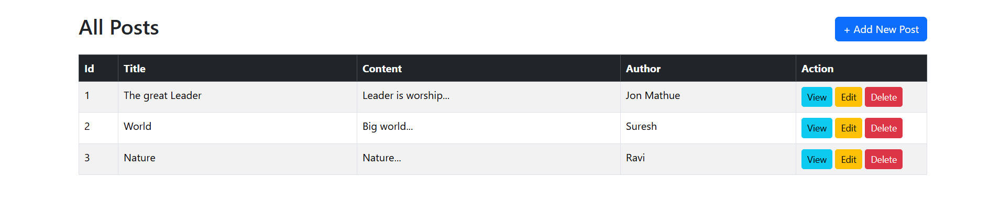
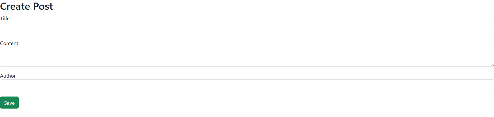
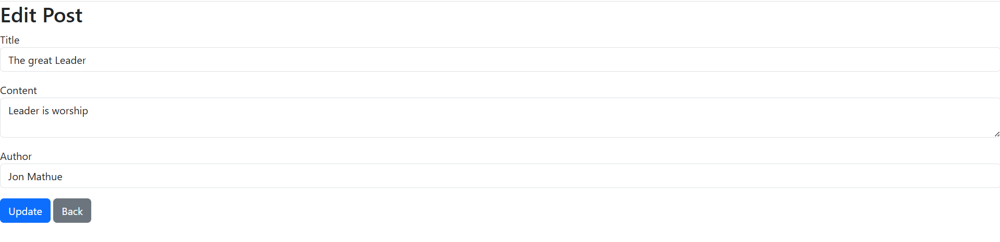
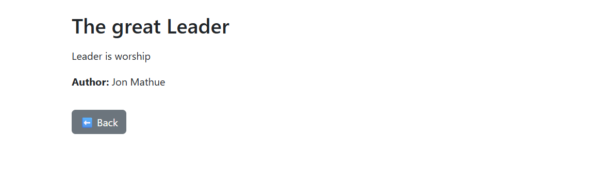
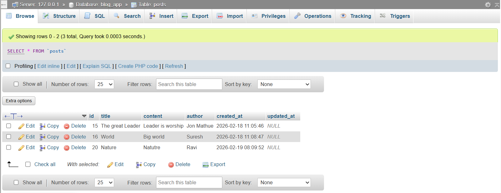

# blog-app
CodeIgniter 4 Blog App
# Blog Application

A simple Blog Application developed using CodeIgniter 4 framework.

## Project Description
This project is a basic blog management system where users can perform CRUD operations
(Create, Read, Update, Delete) on blog posts.

The application displays a list of blog posts and allows adding, editing, viewing,
and deleting posts through a simple dashboard interface.

## Features
- Display all blog posts in a table
- Add new blog post
- View blog post details
- Edit existing blog post
- Delete blog post
- Author name support

## Tech Stack
- PHP (CodeIgniter 4)
- MySQL
- HTML, CSS, Bootstrap
- JavaScript

## Project Structure
- `app/` → Controllers, Models, Views
- `public/` → Public assets (CSS, JS)
- `system/` → CodeIgniter core files
- `writable/` → Logs and cache

## How to Run the Project
1. Clone the repository
2. Import database
3. Update .env file
4. Run using XAMPP / Apache

## Screenshots
### All Posts Page

### Add Post

### Edit Post

### View Post

### Database
### Post Table

